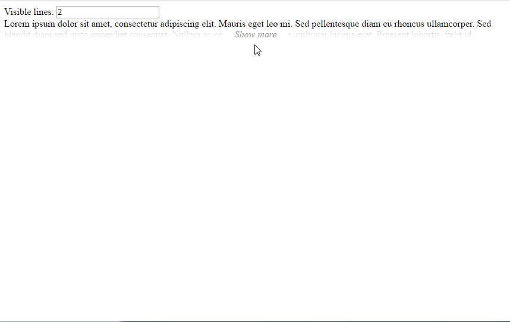

# ember-expand-multiline
[![npm Version][npm-badge]][npm]
[![Build Status][travis-badge]][travis]
[](http://emberobserver.com/addons/ember-expand-multiline)
[![Ember badge][ember-badge]][embadge]



## Requirements
* Ember >= 1.13.0
* Ember CLI

## Installing

* ember-cli >= 0.2.3 `ember install ember-expand-multiline`

## Upgrading

It's advisable to run `ember g ember-expand-multiline` between upgrades as dependencies may have been added, removed, or upgraded between releases.  Please try this, along with clearing `node_modules` and `bower_components` before reporting issues after upgrading.

## Usage

```hbs
{{#expand-multiline visibleLines=2}}
  YOUR TEXT HERE
{{/expand-multiline}}
```

###Properties

| Tables        | Default  | Definition  |
| ------------- |:--------:| -----------:|
| theme         | default  | Main class of the component |
| visibleLines  | 2        | Visible lines when collapsed |
| showLess      | true     | Show/Hide Show Less button when expanded |

###Config
You can set the default values in `config/environment.js` following the next structure:
```js
  var ENV={
    'ember-expand-multiline': {
      theme: 'default',
      showLess: true,
      visibleLines: 2
    }
  }

  return ENV;
```

## Development

* `git clone` this repository
* `npm install`
* `bower install`
* `ember server`
* Visit your app at http://localhost:4200.

## Running Tests

* `ember test`
* `ember test --server`

## Building

* `ember build`

For more information on using ember-cli, visit [http://www.ember-cli.com/](http://www.ember-cli.com/).

[npm]: https://www.npmjs.org/package/ember-expand-multiline
[npm-badge]: https://img.shields.io/npm/v/ember-expand-multiline.svg?style=flat-square
[travis]: https://travis-ci.org/sergiferran/ember-expand-multiline
[travis-badge]: https://img.shields.io/travis/sergiferran/ember-expand-multiline.svg?branch=master&style=flat-square
[embadge]: http://embadge.io/
[ember-badge]: http://embadge.io/v1/badge.svg?start=1.13.0